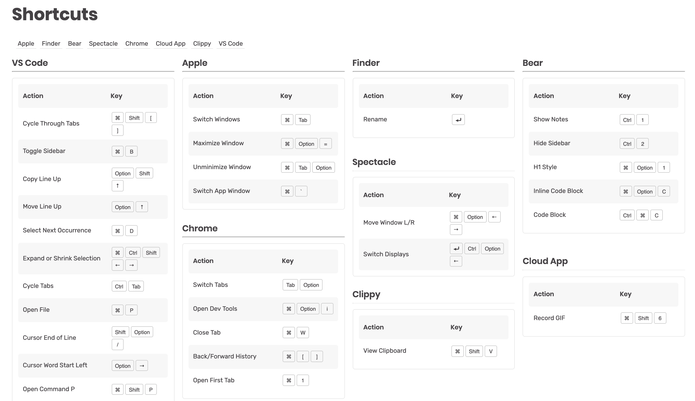

# Shortcuts

[See Live Demo Here](https://shortcuts.anjagusev.com)

**Description:** A simple react application that takes in a JSON file consisting of applications and their associated keyboard shortcuts and outputs them in a nice view, with functionality to filter shortcuts per application.

I made this small project to practice my CSS Grid, Sass, Sketch, and React skills while making something useful for myself. I am constantly switching between Windows and macOS environments so I sometimes forget keyboard shortcuts.

It takes in a JSON file in the following format:

```
 {
    "title": "Apple",
    "commands": [
      { "action": "Switch Windows", "keys": ["⌘", "Tab"] },
      { "action": "Maximize Window", "keys": ["⌘", "Option", "="] },
      { "action": "Unminimize Window", "keys": ["⌘", "Tab", "Option"] },
      { "action": "Switch App Window", "keys": ["⌘", "`"] }
    ]
  },
  {
    "title": "Finder",
    "commands": [
      {
        "action": "Rename",
        "keys": ["⏎"]
      }
    ]
  },
```

Preview:


**Known Issues**:

Each table’s size depends on the number of shortcuts associated with each application.

To handle this, I programmatically added CSS classes which specify how many rows each table should span, based on the number of shortcuts they contain. The class naming convention is `.v3`. V for vertical and 3 for the number of items to span.

For example, the Finder table in the above screenshot has a CSS class of `.v3` because it only contains 1 keyboard shortcut. This means that the table needs to span at least 3 grid items, so there is enough room for the application title, the table headers and the shortcut itself.

However, I found that for classes `.v6` and above, they needed to span 1 less. So `.v6` is actually `.v6 { grid-row: span 5;}`. If you span 6, there is a lot of extra whitespace.

Any suggestions on how to improve this code are more than welcome!

---

This project was bootstrapped with [Create React App](https://github.com/facebook/create-react-app).

## Available Scripts

In the project directory, you can run:

### `npm start`

Runs the app in the development mode.<br>
Open [http://localhost:3000](http://localhost:3000) to view it in the browser.

The page will reload if you make edits.<br>
You will also see any lint errors in the console.

### `npm test`

Launches the test runner in the interactive watch mode.<br>
See the section about [running tests](https://facebook.github.io/create-react-app/docs/running-tests) for more information.

### `npm run build`

Builds the app for production to the `build` folder.<br>
It correctly bundles React in production mode and optimizes the build for the best performance.

The build is minified and the filenames include the hashes.<br>
Your app is ready to be deployed!

See the section about [deployment](https://facebook.github.io/create-react-app/docs/deployment) for more information.

### `npm run eject`

**Note: this is a one-way operation. Once you `eject`, you can’t go back!**

If you aren’t satisfied with the build tool and configuration choices, you can `eject` at any time. This command will remove the single build dependency from your project.

Instead, it will copy all the configuration files and the transitive dependencies (Webpack, Babel, ESLint, etc) right into your project so you have full control over them. All of the commands except `eject` will still work, but they will point to the copied scripts so you can tweak them. At this point you’re on your own.

You don’t have to ever use `eject`. The curated feature set is suitable for small and middle deployments, and you shouldn’t feel obligated to use this feature. However we understand that this tool wouldn’t be useful if you couldn’t customize it when you are ready for it.
